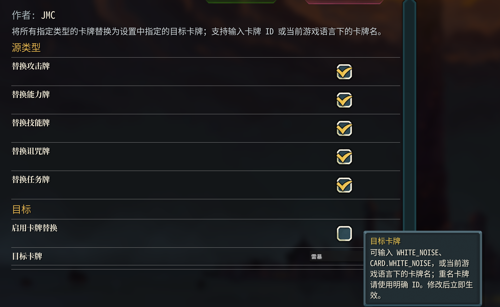

<p align="center">
  <a href="README.md"></a>
  <a href="README_en.md"></a>
  <a href="CHANGELOG.md"></a>
  <a href="https://github.com/JMC-Mods/SlayTheSpire2_AllCardIs/releases"></a>
<!-- code-stats:start -->
  <a href="https://github.com/JMC-Mods/SlayTheSpire2_AllCardIs/actions/workflows/code-lines.yml"></a>
  <a href="https://github.com/JMC-Mods/SlayTheSpire2_AllCardIs/actions/workflows/code-lines.yml"></a>
  <a href="https://github.com/JMC-Mods/SlayTheSpire2_AllCardIs/actions/workflows/code-lines.yml"></a>
  <a href="https://github.com/JMC-Mods/SlayTheSpire2_AllCardIs/actions/workflows/code-lines.yml"></a>
  <a href="https://github.com/JMC-Mods/SlayTheSpire2_AllCardIs/actions/workflows/code-lines.yml"></a>
  <a href="https://github.com/JMC-Mods/SlayTheSpire2_AllCardIs/actions/workflows/code-lines.yml"></a>
  <a href="https://github.com/JMC-Mods/SlayTheSpire2_AllCardIs/actions/workflows/code-lines.yml"></a>
<!-- code-stats:end -->
</p>

# 所有卡牌全变为...
##  0. 安装

### Mod本体安装
Steam版本直接在创意工坊订阅即可（暂未开放）

其他版本可以自行编译，或者在[📦 Releases](https://github.com/JMC-Mods/SlayTheSpire2_AllCardIs/releases)界面下载.zip后解压到游戏安装目录下的Mods
目录下（没有就新建一个）

### 前置安装
**此外，本模组强依赖于模组[JmcModLib](https://github.com/JMC2002/JmcModLib_STS2/releases)**，安装方法同上

安装完成后的目录结构如下：

```sh
-- Slay the Spire 2
    |-- SlayTheSpire2.exe
        |-- mods
             |-- JmcModLib
             |-- AllCardIs
                  |-- AllCardIs.dll
                  |-- AllCardIs.pck
                  |-- AllCardIs.json
```

### 存档迁移
> 当你第一次安装MOD，游戏会默认将开启Mod的存档与没开启的隔离，可以按下面的方法迁移存档：

在安装好MOD后第一次打开游戏会询问是否启用MOD，启用并再次打开游戏一次后，退出游戏，将`%appdata%\SlayTheSpire2\steam\`下面的数字文件夹下的你对应的存档文件粘贴到该文件夹的`modded`文件夹中，以同步使用MOD前后的存档

---
## 🧠 1. 简介
将所有牌变为某一张牌

[演示视频（B站）](https://www.bilibili.com/video/BV1oMQcB4EJS)

[Github仓库](https://github.com/JMC-Mods/SlayTheSpire2_AllCardIs)
## ⚙️ 2. 功能
- 将所有牌（可选攻击、技能、诅咒、能力、事件牌）变为某一张牌，在设置界面输入牌的 ID、`CARD.xxx`，或当前游戏语言下的卡牌名（如中文界面的“爪击”）即可；如果牌名重名（如“打击”），请改用明确 ID。不知道 ID 的可以去[Wiki](https://sts2.huijiwiki.com/wiki)查阅
 
- 当你想关闭这个MOD，直接在设置内关闭功能即可，不需要重启游戏/取消订阅

## 🔔 3. 提醒
- **本模组强依赖于模组[JmcModLib](https://github.com/JMC2002/JmcModLib_STS2/releases)**
 
## 🧩 4. 兼容性
- 由于游戏处于EA阶段，可能会随着游戏版本更新而失效

## 🧭 5. TODO


**如果你喜欢这个 Mod 的话，希望可以点一个star~**
